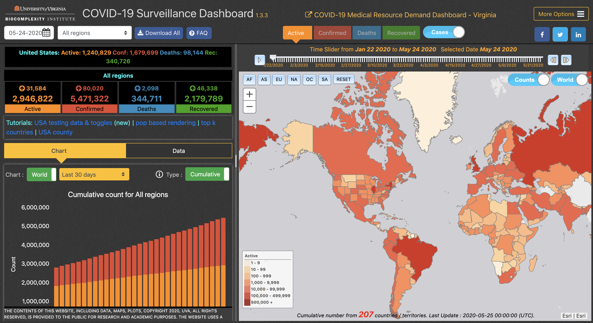
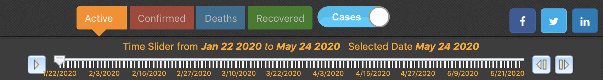
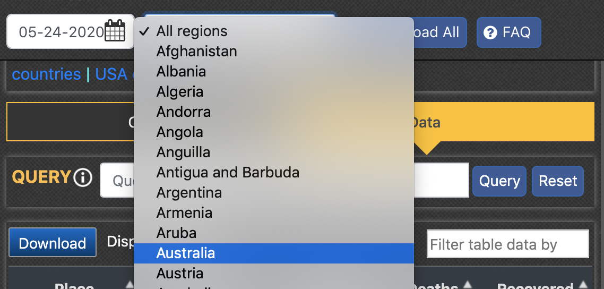
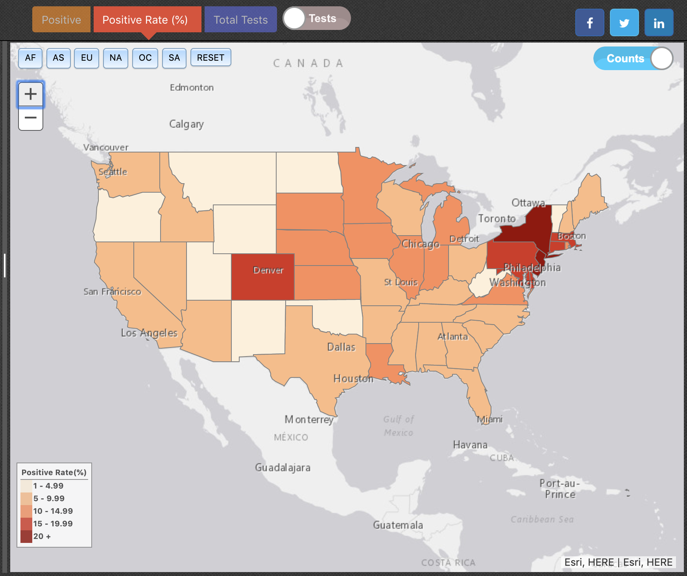
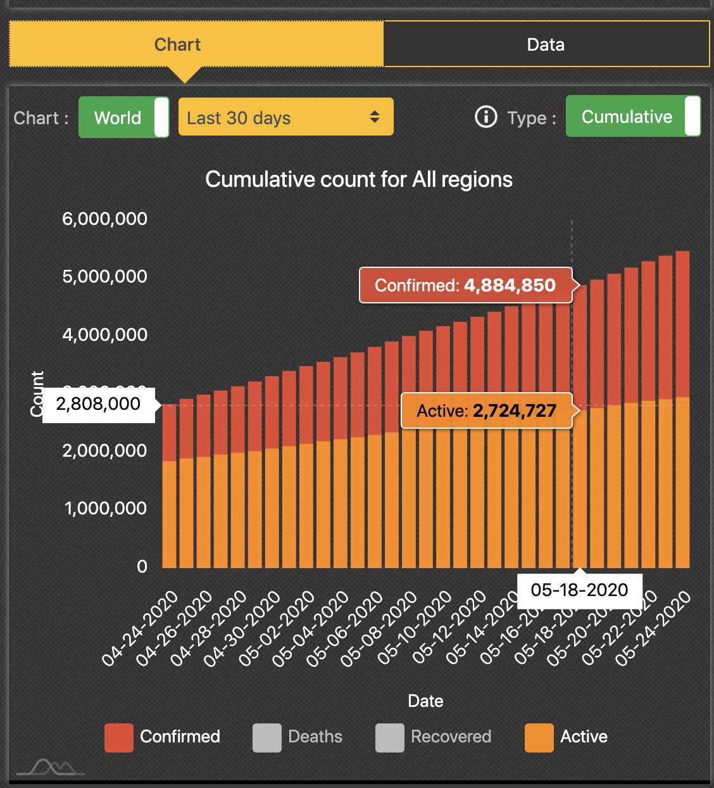
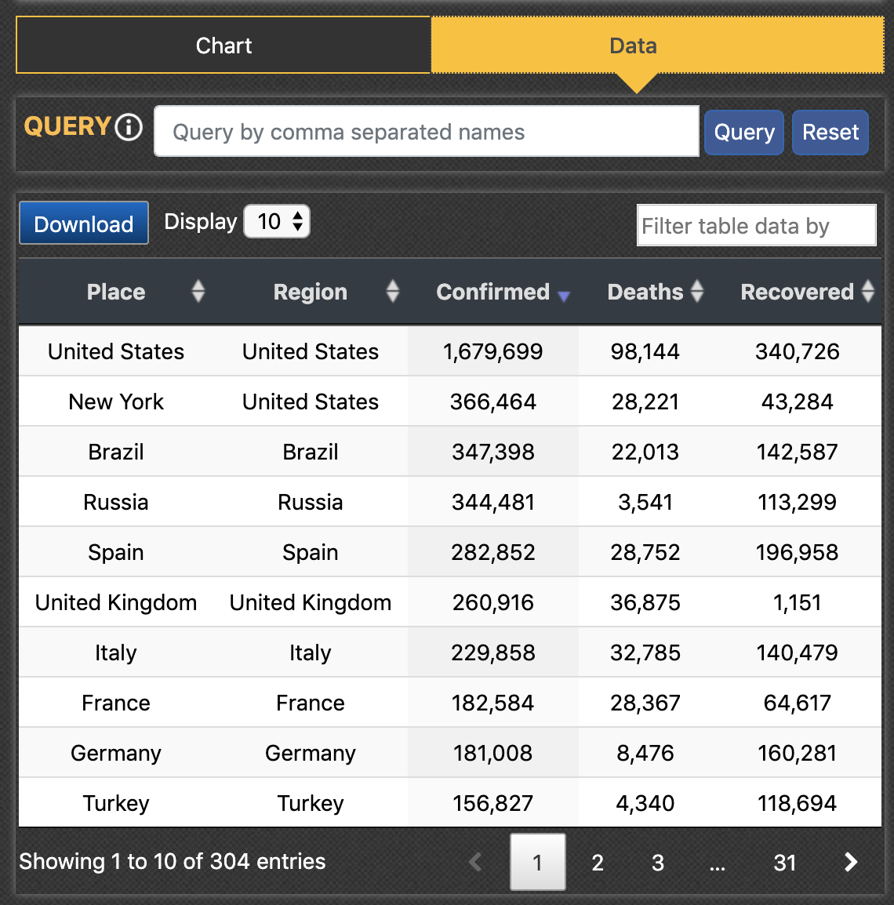
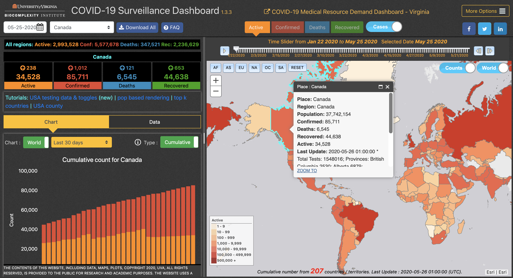
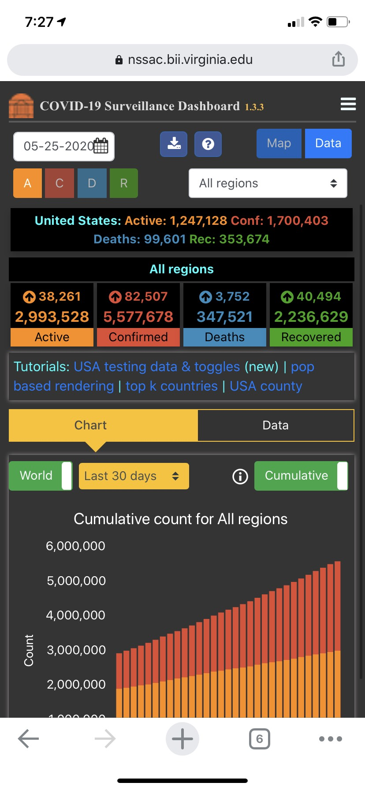
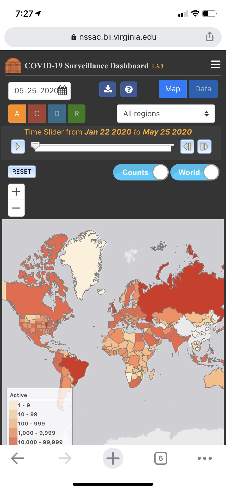

# Mapping Coronavirus

Smart dashboards are a critical tool for displaying information in a manner that is palatable and easy to navigate for its viewers. The graphical user interfaces give an at-a-glance view of a given topic at hand, with various components to highlight certain information or graphics. Dashboards are often used to track events in real time, more or less. They have become the norm in data display for more complex matters as opposed to say, a series of traditional maps.

Dashboards are unique in that they are generally very interactive. Their unique structure allows for data to be highly organized, and often more up-to-date. Users are able to visualize the information and see patterns in the data, making sense of it and interpreting results at a deeper level than what a static map can provide. They can take complex and overwhelming information and transform it to be systematic and detailed. By taking all of this and formatting it so that it can be interacted with, stories can be told through the data, and is generally thought to be more engaging and impactful than a more simple map.

> “Dashboards provide a visual means to organize and interact with data, enabling users to drill down into data sets, filter out uninteresting data, select an item or group of data and retrieve details, view relationships among items, extract sub-collections, and to overlay and interconnect disparate data, enabling summary-to-detail exploration within a single visualisation system.”
> (Dubriwny and Rivards, 2004; Few, 2006)

One example of an influential dashboard is the Dublin Dashboard, which was created to compare the city with others, hoping to give insight into what could be improved upon to improve the city as a whole. This dashboard is a prime example of their complex socio-technical properties, giving a look into their complexity. They have the advantage of evolution, with intermittent updates to maximize performance and presentation. However social, financial, and political contexts must always be kept in mind. This is because of the wide recursive effects that a dashboard may have. With the growth of a dashboard, attention may be brought to things not originally planned. For example, the Dublin Dashboard had originally been for the sake of comparison, but in turn gave a deeper look into Dublin City Council’s management. These effects should be considered when developing a dashboard. They can also be limited by the software that is used to develop it, and are only used to display data that already exists.

Despite these setbacks, however, there are still many dashboards which utilize their strengths appropriately in order to provide the public with useful and approachable information. We will take a look at two dashboards showing the spread of novel coronavirus, comparing and contrasting their methods and gaining a deeper understanding of how these maps can be useful to us in times of need.

---------------

## COVID-19 Surveillance Dashboard



This dashboard was created by University of Virginia’s Biocomplexity Institute. It includes interactive maps which display up-to-date data on the spread of COVID-19. It allows people to see the world at a glance, or view specific countries. Its main purpose is in education, awareness, and accuracy.

### Features

#### Map View

The map has many features, many of which are fully interactive. The data itself is not limited to the number of cases as the title may suggest. Rather, the viewer has the option to view active cases, confirmed cases, deaths, and recovered cases. There is a slider which can be adjusted to show the chosen option on a selected date, and even the option to animate through the days to see the progression of the virus. This is useful in tracking the spread as well as gaining a better perspective on how a pandemic may come to be.


*Some of the options available for user customization.*

Additionally, the viewer has the option to refine the region that they are viewing. There is a dropdown menu (on the leftmost panel) where the viewer can select a single country, or tabs (located in the upper left of the map panel) where a single continent may be selected.


*Dropdown menu where users can select a country of their choice, and view that country’s data.*

The viewer also has the choice to switch from a case view to a testing view. Here, the map can display positive tests, the rate of positive tests as a percentage, and the total number of tests performed, in a similar format to the case counts. This map is more limited, as it only displays testing information for the United states.


*Display of the positive test rate (%) for the United States.*

#### Map Charts and Analysis

Upon launch of the site, the dashboard will display basic data in the form of bar graphs, seen on the leftmost panel. The default view shows the total global confirmed cases, and total global active cases. The counts for deaths and recoveries can be toggled on, though their default is to be toggled off. All four of these can be toggled on or off at the user’s discretion. It is organized by day, to show worldwide trends for the last 30 days. This of course can be adjusted as well, even with an option to view cumulative counts, or daily counts.


*Default display shows data as bar graphs of current and cumulative cases.*

By clicking into the “data” tab, we get a more solid view of the numbers behind the graphics. The data tables will by default show the top 10 countries with the highest number of confirmed cases. Much like the charts, this can be fully customized to meet the interest and curiosity of viewers. You may display more or less items at a time, and rank by whichever category you prefer. There is also a more advanced query tool that can be used.


*Data shows tables of confirmed cases, deaths, and recoveries.*

The dashboard is fully interactive, and so all of its features will update to reflect the current selection on the main map. This makes it incredibly easy to read and understand. You can see this in the example below, in which Canada is selected, and the appropriate information is updated to match.



### Architecture

#### Map Style

The dashboard uses a choropleth map to represent the magnitude of cases, recoveries, etc. in each applicable region. There are many other dashboards which instead use a graduated symbol representation. This is good for large-scale, general imagery, however it could result in unintentional bias and visual deception.

#### Libraries

This dashboard uses [Bootstrap](https://getbootstrap.com/), [jQuery](https://jquery.com/), and [amCharts](https://www.amcharts.com/). Fonts used are from [Font Awesome](https://fontawesome.com/).
```
<!-- local css to layout -->
	<link rel="stylesheet" href="css/layout-local.css" />

	<link rel="stylesheet" href="https://maxcdn.bootstrapcdn.com/bootstrap/4.3.1/css/bootstrap.min.css">

	<link rel="stylesheet" href="https://maxcdn.bootstrapcdn.com/font-awesome/4.7.0/css/font-awesome.min.css">

	<link href="https://cdn.jsdelivr.net/gh/gitbrent/bootstrap4-toggle@3.6.1/css/bootstrap4-toggle.min.css" rel="stylesheet">


```

#### Mobile Version

While this map does support responsive design, it is not the most optimized as of yet. The mobile version of this web map does adjust to fit the screen of the mobile device, but all of the same elements are kept, which can create a clunky appearance. However the map and the charts/data are kept under separate tabs, so it is not too overwhelming. This aspect could be improved upon to be more streamlined and less sensitive, as it is easy to accidentally alter the elements from a single swipe.

 

### Data

All of the data used is open source, and accessible online. It is largely vector data. The map is updated with any new case information every 2-3 hours. Testing data for the US is updated once per day. The UVA COVID-19 dashboard uses the following sources for their map’s data:
-	[WHO](https://www.who.int/emergencies/diseases/novel-coronavirus-2019/situation-reports/)
-	[CDC](https://www.cdc.gov/coronavirus/2019-ncov/index.html)
-	[ECDC](https://www.ecdc.europa.eu/en/geographical-distribution-2019-ncov-cases)
-	[NHC](http://www.nhc.gov.cn/yjb/new_index.shtml)
-	[1point3acres](https://www.1point3acres.com/)
-	[DXY](https://3g.dxy.cn/newh5/view/pneumonia)
-	[QQ](https://news.qq.com/zt2020/page/feiyan.htm)
-	[JHU CSSE](https://github.com/CSSEGISandData/COVID-19)
-	[ADCi](https://www.adci.com/adc-worldmap/)
-	[ESRI](https://https//www.esri.com/en-us/home)
-	[The Covid Tracking Project](https://covidtracking.com/data)

By using many sources for various types of information, the project has high validity. The open source data is available for free online, and is accessible to anyone, so there is little to no chance of any manipulation.


### Reflection

This dashboard is one of the most popular dashboards centered around the spread of COVID-19. It is a comprehensive display of any relevant and current information about the pandemic and its relevant rates, which many people are looking for in this time of great confusion.

Some of the strengths of UVA's dashboard are its incredible amount and attention to detail. There are many sources and it is constantly being updated, making it a fairly reliable and unbiased source of information. Because of its smooth and functional design, the most people should not have many difficulties in viewing it and understanding what is being shown to them. The amount of flexibility and customization that is possible makes for an incredibly interactive map, which is one of the core attributes of a dashboard.

That is not to say that it is without flaw, however. The map could be overwhelming for casual viewers, or people who are new to these types of maps. With growing fears about the pandemic, many people are looking for answers and could come across this dashboard. It has a lot of good information but may be an overload for someone who is unfamiliar with such displays. The digital divide (as well as design basics) has proven to us that simplicity is best. By taking on a more simplified structure, the dashboard could be much more user-friendly, for all types of people (not just the tech-savvy). One idea of how to ease the viewer into the dashboard could be a sort of home page or landing page, with which the viewer could pick what they want to view. The dashboard would then load to fit those preferences. This view could be changed at any time, similar to how it is now.

The dashboard also has a link to a related dashboard, entitled the COVID-19 Medical Resource Demand Dashboard. It was also created by the University of Virginia's Biocomplexity Institute. It differs from the COVID-19 Dashboard in that it only displays data for the state of Virginia. However it is still interesting to look at,as it is very relevant to the spread of coronavirus, and should not necessarily be left out of conversation.

Overall, this map is a very good example of what dashboards are capable of, and just how much they can aid in providing the necessary information.

You can interact with the map [here](https://nssac.bii.virginia.edu/covid-19/dashboard/).
